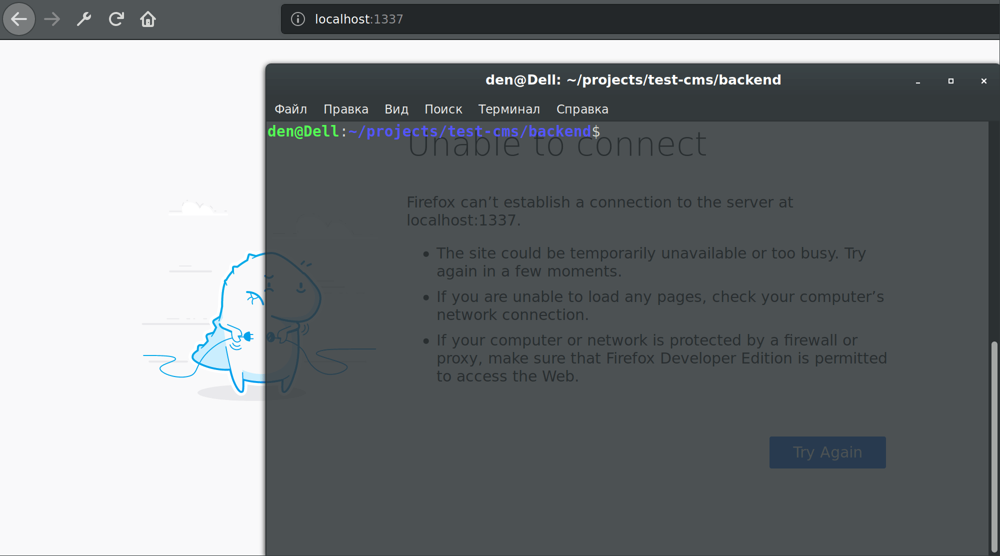

# TEST CMS

## Demo



## Stack
- Strapi 3.0.0-alpha.24.1
- SQLite
- React 16.8.6 by `create-react-app` _(ejected)_

## Install & build & start
```
$ yarn add global strapi@alpha
$ cd frontend && yarn install && yarn build
$ cd ../backend && yarn install
$ strapi start
```

Should be built to `/backend/public/` as distr folder.
Should be started on [localhost:1337](http://localhost:1337/).

## TODO: backend
- [x] CRUD
- [x] `User.companyrole` _as string_ `employee|boss`, _employee by default_
- [x] `User.bossInfo` _as json (will be used for employee role)_
- [ ] socket.io for content updating

## TODO: frontend
- [x] redux / redux-thunk
- [ ] Relations: **employee -> boss** | Ability to select the boss for the employee (for the **boss** role only?)
- [x] Login form for _withAuth HOC_ | Token will be set to cookies as `jwt`
- [ ] socket.io for content updating
